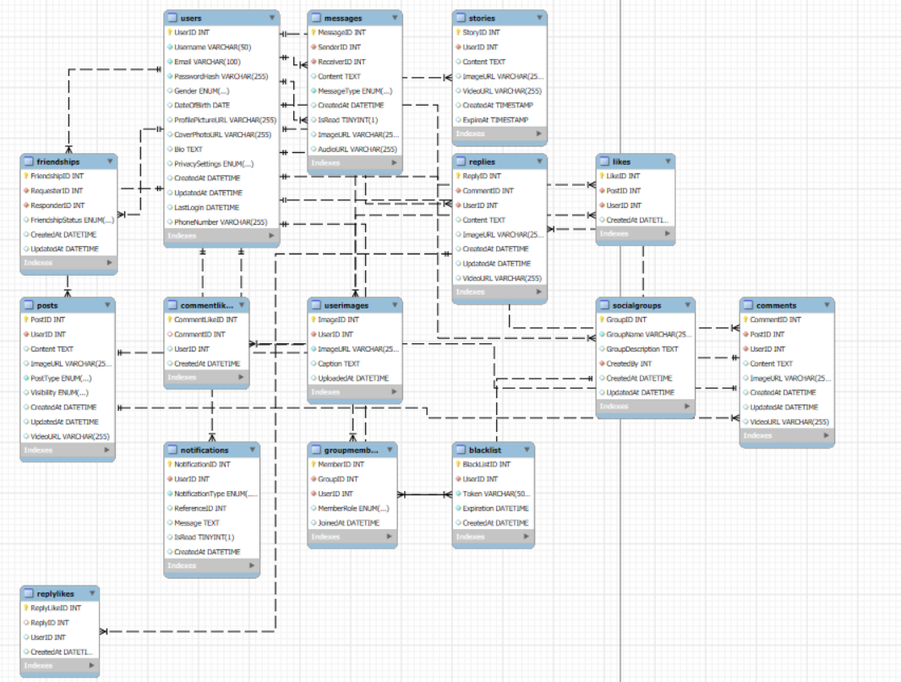

# FACEBOOK Database

## Overview

The **FACEBOOK** database is designed to support a social networking platform with features similar to Facebook. This database enables functionalities for user interaction, including creating posts, comments, likes, messages, notifications, and friendships. The structure supports essential social media features, allowing users to engage with each other effectively.

## Database Structure

### Tables and Relationships

1. **Users**
   - **Description**: Stores user information, including personal details and account settings.
   - **Columns**:
     - `UserID`: Primary key, unique identifier for each user.
     - `Username`: User's name, `VARCHAR(50)`, required.
     - `Email`: User's email address, `VARCHAR(100)`, unique and required.
     - `PasswordHash`: Encrypted password, `VARCHAR(255)`, required.
     - `Gender`: User's gender, options are `male`, `female`, or `other`.
     - `DateOfBirth`: Date of birth.
     - `ProfilePictureURL`: URL to profile picture.
     - `CoverPhotoURL`: URL to cover photo, default is `default`.
     - `Bio`: User's biography.
     - `PrivacySettings`: Account privacy setting, options are `public`, `private`, or `friends`.
     - `CreatedAt`: Timestamp of account creation.
     - `UpdatedAt`: Timestamp of last profile update.
     - `LastLogin`: Timestamp of the last login.
     - `PhoneNumber`: User's phone number, optional.

2. **UserImages**
   - **Description**: Stores images uploaded by users.
   - **Columns**:
     - `ImageID`: Primary key, unique identifier for each image.
     - `UserID`: Foreign key referencing `Users(UserID)`.
     - `ImageURL`: URL of the image.
     - `Caption`: Image caption.
     - `UploadedAt`: Timestamp of when the image was uploaded.

3. **Stories**
   - **Description**: Stores temporary stories created by users.
   - **Columns**:
     - `StoryID`: Primary key, unique identifier for each story.
     - `UserID`: Foreign key referencing `Users(UserID)`.
     - `Content`: Text content of the story.
     - `ImageURL`: URL to the story image.
     - `VideoURL`: URL to the story video.
     - `CreatedAt`: Timestamp of story creation.
     - `ExpireAt`: Expiration timestamp of the story.

4. **Posts**
   - **Description**: Stores user posts.
   - **Columns**:
     - `PostID`: Primary key, unique identifier for each post.
     - `UserID`: Foreign key referencing `Users(UserID)`.
     - `Content`: Text content of the post.
     - `ImageURL`: URL to an image associated with the post.
     - `PostType`: Type of post, options are `text`, `image`, `video`, `link`.
     - `Visibility`: Post visibility, options are `public`, `friends`, or `private`.
     - `CreatedAt`: Timestamp of post creation.
     - `UpdatedAt`: Timestamp of the last post update.
     - `VideoURL`: URL to a video associated with the post.

5. **Comments**
   - **Description**: Stores comments on posts.
   - **Columns**:
     - `CommentID`: Primary key, unique identifier for each comment.
     - `PostID`: Foreign key referencing `Posts(PostID)`.
     - `UserID`: Foreign key referencing `Users(UserID)`.
     - `Content`: Text content of the comment.
     - `ImageURL`: URL to an image associated with the comment.
     - `CreatedAt`: Timestamp of comment creation.
     - `UpdatedAt`: Timestamp of the last comment update.
     - `VideoURL`: URL to a video associated with the comment.

6. **Replies**
   - **Description**: Stores replies to comments.
   - **Columns**:
     - `ReplyID`: Primary key, unique identifier for each reply.
     - `CommentID`: Foreign key referencing `Comments(CommentID)`.
     - `UserID`: Foreign key referencing `Users(UserID)`.
     - `Content`: Text content of the reply.
     - `ImageURL`: URL to an image associated with the reply.
     - `CreatedAt`: Timestamp of reply creation.
     - `UpdatedAt`: Timestamp of the last reply update.
     - `VideoURL`: URL to a video associated with the reply.

7. **Likes**
   - **Description**: Stores likes on posts.
   - **Columns**:
     - `LikeID`: Primary key, unique identifier for each like.
     - `PostID`: Foreign key referencing `Posts(PostID)`.
     - `UserID`: Foreign key referencing `Users(UserID)`.
     - `CreatedAt`: Timestamp of when the like was made.

8. **CommentLikes**
   - **Description**: Stores likes on comments.
   - **Columns**:
     - `CommentLikeID`: Primary key, unique identifier for each comment like.
     - `CommentID`: Foreign key referencing `Comments(CommentID)`.
     - `UserID`: Foreign key referencing `Users(UserID)`.
     - `CreatedAt`: Timestamp of when the like was made.

9. **ReplyLikes**
   - **Description**: Stores likes on replies.
   - **Columns**:
     - `ReplyLikeID`: Primary key, unique identifier for each reply like.
     - `ReplyID`: Foreign key referencing `Replies(ReplyID)`.
     - `UserID`: Foreign key referencing `Users(UserID)`.
     - `CreatedAt`: Timestamp of when the like was made.

10. **Friendships**
    - **Description**: Stores friendships and friend requests between users.
    - **Columns**:
      - `FriendshipID`: Primary key, unique identifier for each friendship.
      - `RequesterID`: Foreign key referencing `Users(UserID)`, the user who sent the request.
      - `ResponderID`: Foreign key referencing `Users(UserID)`, the user who received the request.
      - `FriendshipStatus`: Status of the friendship, options are `requested`, `accepted`, or `blocked`.
      - `CreatedAt`: Timestamp of when the friendship was created.
      - `UpdatedAt`: Timestamp of the last update.

11. **Messages**
    - **Description**: Stores messages exchanged between users.
    - **Columns**:
      - `MessageID`: Primary key, unique identifier for each message.
      - `SenderID`: Foreign key referencing `Users(UserID)`.
      - `ReceiverID`: Foreign key referencing `Users(UserID)`.
      - `Content`: Text content of the message.
      - `MessageType`: Type of message, options are `text`, `image`, `video`.
      - `CreatedAt`: Timestamp of message creation.
      - `IsRead`: Boolean indicating if the message has been read.
      - `ImageURL`: URL to an image (if any) in the message.
      - `AudioURL`: URL to an audio file (if any) in the message.

12. **Notifications**
    - **Description**: Stores notifications for user actions (e.g., likes, comments, friend requests).
    - **Columns**:
      - `NotificationID`: Primary key, unique identifier for each notification.
      - `UserID`: Foreign key referencing `Users(UserID)`.
      - `NotificationType`: Type of notification, options are `like`, `comment`, `friend_request`, `system`.
      - `ReferenceID`: ID related to the specific action.
      - `Message`: Notification message.
      - `IsRead`: Boolean indicating if the notification has been read.
      - `CreatedAt`: Timestamp of notification creation.

13. **SocialGroups**
    - **Description**: Stores information about user-created social groups.
    - **Columns**:
      - `GroupID`: Primary key, unique identifier for each group.
      - `GroupName`: Name of the group.
      - `GroupDescription`: Description of the group.
      - `CreatedBy`: Foreign key referencing `Users(UserID)`, the creator of the group.
      - `CreatedAt`: Timestamp of group creation.
      - `UpdatedAt`: Timestamp of the last update.

14. **GroupMembers**
    - **Description**: Stores members of social groups.
    - **Columns**:
      - `MemberID`: Primary key, unique identifier for each group member.
      - `GroupID`: Foreign key referencing `SocialGroups(GroupID)`.
      - `UserID`: Foreign key referencing `Users(UserID)`.
      - `MemberRole`: Role in the group, options are `member` or `admin`.
      - `JoinedAt`: Timestamp of when the user joined the group.

15. **BlackList**
    - **Description**: Stores tokens of logged-out users for invalidation.
    - **Columns**:
      - `BlackListID`: Primary key, unique identifier for each blacklist entry.
      - `UserID`: Foreign key referencing `Users(UserID)`.
      - `Token`: The token to be invalidated.
      - `Expiration`: Expiration date of the token.
      - `CreatedAt`: Timestamp of when the token was blacklisted.

## Usage

This database schema is designed to support a comprehensive social networking platform with features for user interactions, content sharing, and real-time communication.

